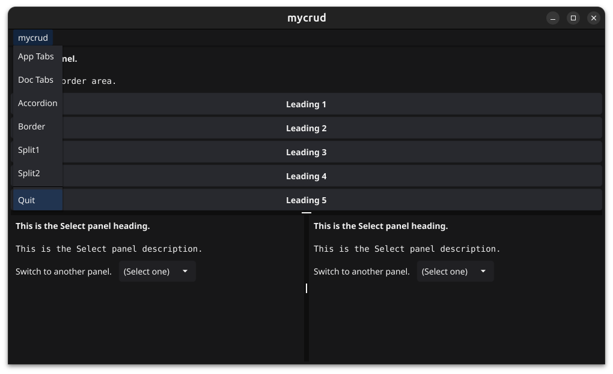

# kickfyne "fyne my way"


Image courtesy of https://isorepublic.com/photo/flying-kick/

## Fun with Fyne

[The Fyne Toolkit](https://fyne.io/) is my favorite Go application tool kit. It is really nice. After creating a couple of apps using the fyne toolkit, I decided to make my own tool to build and manage building my fyne apps. So my tool is called kickfyne.

This is my personal project and is not in any way a part of any of the [Fyne Toolkit projects](https://fyne.io/).

I started this years ago and then stopped while the fyne team made some critical changes. Now that those are made I'm back to having fun with fyne.

kickfyne is a work in progress. I'm using kickfyne to build my morse code trainer. As I build the trainer I am

* fixing bugs in kickfyne.
* improving documentation in kickfyne.
* removing features I don't want anymore.
* adding features I want.

## Up to date summary 

1. kickfyne allows a developer to create a GUI framework.
1. kickfyne allows the developer to modify the framework.
1. The framework is built out of Screens. A Screen is a collection of panels. A panel displays content and handles user input.
1. There is a main menu.
1. The application can open displaying the first item in the main menu or displaying an opening screen.

### The Accordion Screen

An Accordion Screen lays out AccordionItems vertically. Each AccordionItem will use it's own single panel for content or will use another screen for content.

Kickfyne allows the developer to:

1. Add an Accordion Screen with it's AccordionItems.
1. Add and remove AccordionItems from an Accordion Screen.
1. Remove an Accordion Screen.

### The AppTabs Screen

An AppTabs Screen lays out a tabbar with TabItems that the user can not close. The tabbar can be fixed at the top, right, bottom or left of the content. An optional settings tab allows the user to set the tabbar location. Each TabItem will use it's own single panel for content or will use another screen for content.

Kickfyne allows the developer to:

1. Add an AppTabs Screen with it's TabItems.
1. Add TabItems to and remove TabItems from an AppTabs Screen.
1. Remove an AppTabs Screen.

### The DocTabs Screen

A DocTabs Screen lays out a tabbar with TabItems that the user can close. The tabbar can be fixed at the top, right, bottom or left of the content. An optional settings tab allows the user to set the tabbar location. Each TabItem will use it's own single panel for content or will use another screen for content.

Kickfyne allows the developer to:

1. Add a DocTabs Screen with it's TabItems.
1. Add TabItems to and remove TabItems from an DocTabs Screen.
1. Remove a DocTabs Screen.

### The Simple Screen

A Simple Screen displays only one of it's panels at a time.

Kickfyne allows the developer to:

1. Add a Simple Screen with it's panels.
1. Add panels to and remove panels from an Simple Screen.
1. Remove a Simple Screen.

## Example

### Create the framework.

The framework always works when modified with kickfyne.

```shell
💲 mkdir mycrud
💲 cd mycrud
💲 go mod init example.com/mycrud
💲 kickfyne framework
💲 go get fyne.io/fyne/v2/storage/repository@v2.6.3
💲 go mod tidy
💲 go build
💲 ./mycrud
```

### HelloWorld is the kickfyne framwork's opening screen

The kickfyne framwork, when built and run, will open with it's default **HelloWorld** screen. The screen has 2 panels **Hello** and **HelloAgain**.

The **HelloWorld** screen is a Simple screen. A simple screen has 1 or more panels and only displays one panel at a time.

Each panel in a Simple screen uses a Select widget which allows the developer to switch to another panel. That functionality allows the developer see that each of the panels are in fact there. Especially useful after adding and removing panels in a Simple screen.


I will remove the **HelloWorld** screen when I create my real opening screen. Then I will also edit the framework's main menu, removing "HelloWorld" from the main menu and adding my real opening screen's name.

### Add a simple screen to Edit a contact.

A simple screen layout has 1 or more panels but only displays one panel at a time.

This Simple screen is named **Edit** and will have 2 panels, **Select** and **Edit**.
The first panel, which is the Select panel is the default panel. In a real application, the Select panel would display a select list and the Edit panel would display the selected record in a form and allow the user to edit and save or cancel and go back to the select form.

```shell
💲 kickfyne screen add-simple Edit Select Edit
💲 go mod tidy
```

### Add a simple screen to Remove a contact.

Again, a simple screen layout has 1 or more panels but only displays one panel at a time.

The Simple screen is named **Remove** and will have 2 panels, **Select** and **Remove**.
The first panel, which is the Select panel is the default panel. In a real application, the Select panel would display a select list and the Remove panel would display the selected record and allow the user to remove or cancel and go back to the select form.

```shell
💲 kickfyne screen add-simple Remove Select Remove
💲 go mod tidy
```

### Add an AppTabs tabbar screen.

The AppTabs tabbar lays out a tabbar of TabItems.
None of the TabItems can be removed by the user.
The AppTabs screen's API allows TabItems to be added and removed.

This AppTabs screen is named **ContactsAT** and its TabItems are named **Add** **Edit** and **Remove**.

In the command line
 * The tab named Add will gets it's content from it's own Add panel.
 * The tab named Edit is prefixed with *. So it's content comes from a new instance of the Edit screen I previously made.
 * The tab named Remove is prefixed with *. So it's content comes from a new instance of the Remove screen I previously made.

```shell
💲 kickfyne screen add-apptabs ContactsAT Add *Edit *Remove
💲 go mod tidy
```

### Add a DocTabs tabbar screen.

The DocTabs tabbar lays out a tabbar of TabItems.
Any TabItem can be removed by the user.
The DocTabs screen's API also allows TabItems to be added and removed.

This DocTabs screen is named **ContactsDT** and its TabItems are named **Add** **Edit** and **Remove**.

In the command line
 * The tab name Add will gets it's content from it's own Add panel.
 * The tab name Edit is prefixed with *. So it's content comes from another instance of the Edit screen I previously made.
 * The tab name Remove is prefixed with *. So it's content comes from another instance of the Remove screen I previously made.

```shell
💲 kickfyne screen add-doctabs ContactsDT Add *Edit *Remove
💲 go mod tidy
```

### Add an Accordion screen.

The Accordion screen lays out AccordionItems vertically. Each AccordionItem can be opened to present its content.
The Accordion screen's API also allows AccordionItems to be added and removed.

This Accordion screen is named **ContactsAC** and its AccordionItems are named **Add**, **Edit** and **Remove**.

In the command line
 * The label name Add will gets it's content from it's own Add panel.
 * The label name Edit is prefixed with *. So it's content comes from another instance of the Edit screen I previously made.
 * The label name Remove is prefixed with *. So it's content comes from another instance of the Remove screen I previously made.

```shell
💲 kickfyne screen add-accordion ContactsAC Add *Edit *Remove
💲 go mod tidy
```

### Rewrite the app's main menu in the file at frontend/mainmenu/mainmenu.go.

I remove the mainMenuItem for HellowWorld and add the mainMenuItem for the 3 new main screens.

```go
// The first mainMenuItem is also the opening screen.
// The following items in mainMenuItems are ignored and logged without an error.
//   - Repeated labels.
//   - Invalid screen package names.
//   - Invalid presets names.
var mainMenuItems = []mainMenuItem{
	{
		label:  "App Tabs",
		screen: "ContactsAT",
		preset: "Default",
	},
	{
		label:  "Doc Tabs",
		screen: "ContactsDT",
		preset: "Default",
	},
	{
		label:  "Accordion",
		screen: "ContactsAC",
		preset: "Default",
	},
}
```

### The opening screen.

I have not removed the **HelloWorld** screen but I will in the next step.

For that reason, I should rewrite `var openingScreen` in mainmenu/mainmenu.go because it references that **HelloWorld** screen. If I don't correct `var openingScreen` the framework will quietly

1. Print an error message to stdout.
1. Display the first screen in the main menu.

```go
var openingScreen = mainMenuItem{
		screen: "HelloWorld",
		preset: "Default",
}
```

### Remove that default HelloWorld screen and build the app.

```shell
💲 kickfyne screen remove HelloWorld
💲 go build
💲 ./mycrud
```

I am too lazy to correct the definition of `var openingScreen` in mainmenu/mainmenu.go. So, because there is no **HelloWorld** screen now to open with, the application will silently print an error message and then go ahead and open with the ContactsAT screen which is the first screen named in MainMenu.

### The ContactsAT screen

The **ContactsAT** screen is an AppTabs screen. The user can not close an AppTabs tab. The **ContactsAT** screen is shown below with its default panel **Add** displayed.


### The ContactsDT screen

The **ContactsDT** screen is an DocTabs screen. The **ContactsDT** screen is shown below with its **Edit** tab displayed. The **Edit** tab is using its own instance of the **Edit** screen for content. The **Edit** screen is displaying its default **Select** panel.


### The ContactsAC screen

The **ContactsAC** screen is an Accordion screen. The **ContactsAC** screen is shown below with its **Remove** label opened showing its content. The **Remove** label is using its own instance of the **Remove** screen for content. The **Remove** screen is displaying its default **Select** panel.


### The main menu

The main menu is at the top left of the app and it is shown open.




## Screen modification

1. AccordionItems can be appended to and removed from an Accordion screen.
1. TabItems can be appended to and removed from an AppTab screen.
1. TabItems can be appended to and removed from a DocTab screen.
1. Panels can be added to and removed from a simple screen.

```shell
💲 kickfyne screen add-item «screen-package-name» «[*]item name» ...
💲 kickfyne screen remove-item «screen-package-name» «[*]item name» ...
```

## October 27, 2025

Added user configuration to the AppTabs and DocTabs screens. With user configuration

 * The first TabItem following the settings tab is selected at startup.
 * After the user selects the settings tab, makes a change and clicks the dismiss button, the settings tab gets unselected and the previously selected tab is selected. 

By adding a **+** to the verbs `add-apptabs` and `add-apptabs` a tabbar screen is created with a settings tab that allows the user to set where the tabs are located.

```shell
💲 kickfyne screen add-apptabs+ «screen-package-name» «[*]tab-item-name, ...»
💲 kickfyne screen add-doctabs+ «screen-package-name» «[*]tab-item-name, ...»
```

Below is an example showing the selected config tab with its content.


## To do

1. Adding the ability to safely undo changes when an error occurs.
1. Review my API for adding and removing tabs and accordion items.
1. Review my inline and output documentation.
1. Write tests.

## So what is a panel?

A panel has it's own folder where there are 3 files.
1. content.go lays out the content and handles user input.
1. state.go manages the complexities of a changing state and can set state using a preset.
1. preset.go contains the versions of state settings or presets. Usually the **Default** version is all that is needed.

## So what is a screen?

### Accordion Screen

1. A collection of AccordionItems laid out vertically.
1. An AccordionItem either has it's own single panel for content or has another screen for content.

### AppTabs Screen

1. A collection of TabItems laid out in a tabbar.
1. A TabItem either has it's own single panel for content or has another screen for content.

### DocTabs Screen

1. A collection of TabItems laid out in a tabbar.
1. A TabItem either has it's own single panel for content or has another screen for content.

### Simple Screen

1. A collection of panels.
1. Only 1 panel is displayed at a time.
